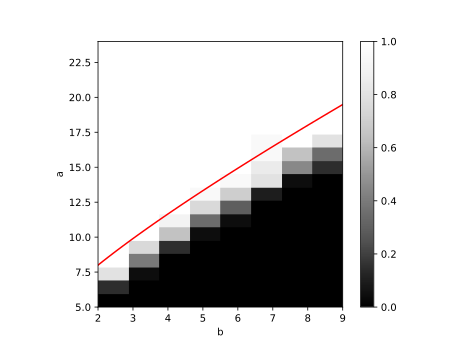

# a novel community detection method based on SIBM
## demo


```
python3 test_ising.py
```

## reproduce Abbe's figure
```
python3 sbm.py --alg sdp2 --multi_thread 20 --repeat 20 --n 300 --k 2 --a 5 25 1 --b 2 10 1 --binary
```
See Figure 4

Abbe, Emmanuel, Afonso S. Bandeira, and Georgina Hall. "Exact recovery in the stochastic block model." IEEE Transactions on Information Theory 62.1 (2015): 471-487.



## Parameter estimation MSE experiment
```
python3 estimator_experiment --action compute
```

## Ising model on SBM, phase transition experiment
```
python3 --n 9000 --repeat 2100 --inner_repeat 6000 --a 16 --b 4 --k 2 --m 1
```

### SBMSI
```
python3 sdp_si_main.py --action plot --filename 2.0-25.0-2.0-10.0
```