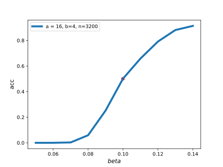
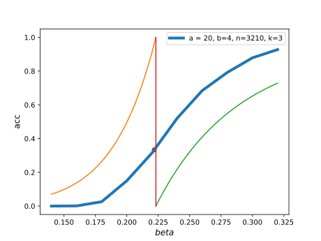
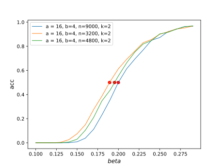

Consider $k=2$, where $B_i \sim Binom(\frac{n}{2}, b\frac{\log n}{n})$

 and $A_i \sim Binom(\frac{n}{2}, a\frac{\log n}{n})$

Unconditional expectation:
$$
E[\sum_{i=1}^n \exp(\beta(B_i - A_i))] = (1-\frac{\log^2 n}{4n}(a^2(e^{-\beta}-1)^2+b^2(e^{\beta}-1)^2))n^{g(\beta)}
$$
Therefore
$$
\frac{P_{\sigma |G}(\mathrm{dist}(\sigma,X)=1)}{P_{\sigma |G}(\sigma=X)}
= \exp(-\beta \gamma \frac{\log n}{n} )\sum_{i=1}^n \exp(\beta_n (B_i - A_i))
$$
where
$$
\beta_n = \beta(1+ \gamma \frac{\log n}{n})
$$

Adding connection with maximum likelihood model.

Let $\mathcal{G} = \{ B_i - A_i < 0, i=1,\dots, n \}$

Conditional expectation (does it work for $\beta > \beta^*$ ?)
$$
E[\sum_{i=1}^n \exp(\beta(B_i - A_i)) | G \in \mathcal{G}] = (1+o(1))n^{g(\beta)}
$$

We conduct an experiment to verify multiple samples $m>1$ and $k=2$:

We choose $n=3200, a=16, b=4, m=3$.

the empirical beta $\hat{\beta} = 0.0999$ while the theoretical transition point is $\beta^*/2 = 0.0991$
$$
\beta^*= \log(\frac{a + b -2 - \sqrt{(a + b - 2)^2 - 4 a b)}}{2  b})
$$

The acc versus $\beta$ near 0.1 is shown in the following figure (the red point is the empirical transition point):

| community detection estimator | parameter            | property            | error bound            | approximation | convergence               |
| ----------------------------- | -------------------- | ------------------- | ---------------------- | ------------- | ------------------------- |
| $\hat{X}^*$                   | $(\gamma, \beta)$    | stochastic          | $n^{g(\bar{\beta})/2}$ | Metropolis    | Markov chain steady state |
| $\hat{X}'$                    | $(\gamma)$           | deterministic       | $n^{g(\bar{\beta})}$   | SDP           |                           |
| $\hat{X}''$                   | $()$                 | deterministic       | $n^{2g(\bar{\beta})}$  | SDP           | SDP dual theory [1]       |
| $\hat{X}^+$                   | $(\gamma, \beta, m)$ | stochastic ensemble | ?                      | ?             | ?                         |

[1] Hajek, Bruce, Yihong Wu, and Jiaming Xu. "Achieving exact cluster recovery threshold via semidefinite programming: Extensions." *IEEE Transactions on Information Theory* 62.10 (2016): 5918-5937.

We have already shown that when $\beta = \beta^*$,

$P_{SIBM}(\sigma = X | D(\sigma, X)) \leq \frac{1}{k}(1+o(1))$.

Simulation results show that it actually takes the equality.

That is: $P_{SIBM}(\sigma = X | D(\sigma, X)) = \frac{1}{k}(1+o(1))$

This result can be used to empirically calculating $\beta^*$ by selecting the acc = $\frac{1}{k}$.

Below is the simulation result for $k=3$:

As we can see, the empirical $\beta*$ (computed by letting acc = 1/3) is very near to the theoretical

vertical red line.

We want to verify that as $n$ becomes large, the acc line will approach the step function at $\beta=\beta^*$:

This figure is not satisfied in the sense that the figure for $\beta>\beta^*$ tends to have lower acc

as $n$ increases. It could be explained as the finite effect of $\beta_n=(1+\gamma \frac{\log n}{n})\beta$

As $n$ becomes larger, the equivalent $\beta_n$ becomes smaller.

But this figure indeed show that $P(\sigma=X)=0.5$ at $\beta=\beta^*$.

